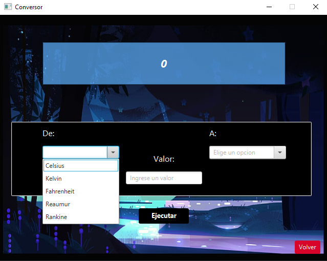

# MENÚ PRINCIPAL

# MENÚ DIVISAS
Podras seleccinar 2 monedas y ingreasar un valor, luego se llamara un API(freecurrencyapi) y se dara la divisa convertida.

Ya que hay "bastantes" divisas puede ser complicado buscar la correcta, por ello puedes ir escribiendola y se filtran las opciones.

# MENÚ TEMPERATURAS
Podras seleccionar 2 temperaturas y ingresar un valor, luego se devolvera el valor convertido.

